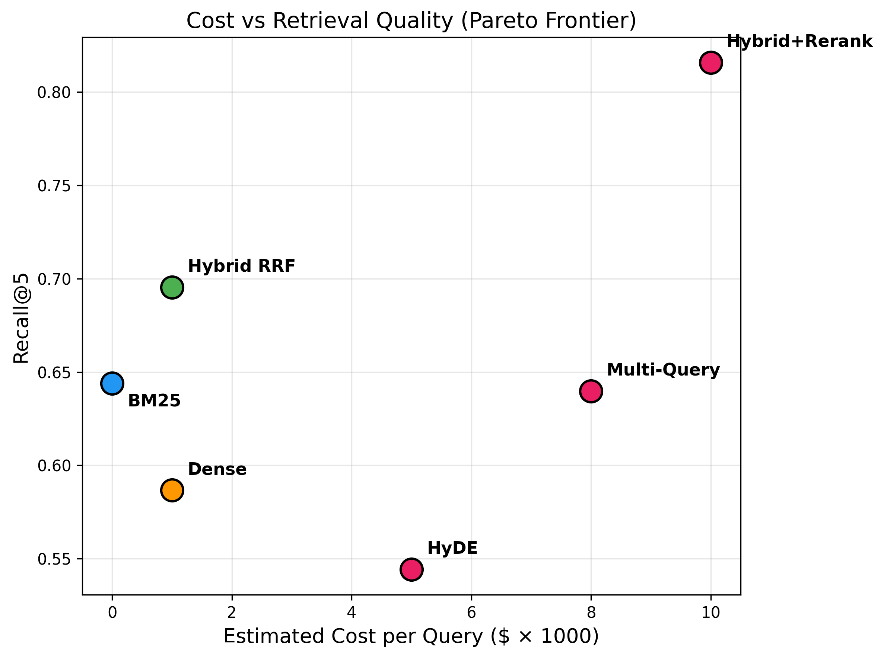

# From BM25 to Corrective RAG: Benchmarking Retrieval Strategies for Text-and-Table Documents

> Comprehensive benchmark of 10 RAG retrieval methods on [T2-RAGBench](https://huggingface.co/datasets/G4KMU/t2-ragbench) (23,088 financial QA pairs, 7,318 documents with text + tables).

**Authors:** Meftun Akarsu (THI) · Christopher Mierbach (Radiate)

**Paper:** [LaTeX source](paper/main.tex) · **Dataset:** [T2-RAGBench on HuggingFace](https://huggingface.co/datasets/G4KMU/t2-ragbench)

---

## Key Findings

| # | Method | Category | R@5 | MRR@3 | nDCG@10 |
|---|--------|----------|-----|-------|---------|
| 1 | HyDE | Query expansion | 0.544 | 0.318 | 0.433 |
| 2 | Dense (text-embed-3-large) | Single-method | 0.587 | 0.351 | 0.466 |
| 3 | Contextual Dense | Index augmentation | 0.615 | 0.373 | 0.490 |
| 4 | Multi-Query + RRF | Query expansion | 0.640 | 0.397 | 0.506 |
| 5 | BM25 | Sparse baseline | 0.644 | 0.411 | 0.515 |
| 6 | CRAG | Adaptive/Agentic | 0.658 | 0.415 | 0.536 |
| 7 | Hybrid RRF | Fusion | 0.695 | 0.433 | 0.551 |
| 8 | Contextual Hybrid | Index augment. + fusion | 0.717 | 0.454 | 0.571 |
| 9 | **Hybrid + Cohere Rerank** | **Fusion + rerank** | **0.816** | **0.605** | **0.683** |

---

## Abstract

Retrieval-Augmented Generation (RAG) systems critically depend on retrieval quality, yet no comprehensive comparison of modern retrieval methods exists for documents containing both text and tabular data. We systematically benchmark ten retrieval strategies -- spanning sparse (BM25), dense, hybrid fusion (RRF, convex combination), cross-encoder reranking, query expansion (HyDE, multi-query), index augmentation (contextual retrieval), and adaptive retrieval (Corrective RAG) -- on the T2-RAGBench dataset comprising 23,088 financial QA pairs over 7,318 documents. We evaluate retrieval quality (Recall@k, MRR, nDCG) and end-to-end generation quality (Number Match) with statistical significance testing.

Our key findings are: (1) a two-stage pipeline of hybrid retrieval with neural reranking achieves the best performance (Recall@5 = 0.816, MRR@3 = 0.605), outperforming all single-stage methods by a wide margin; (2) BM25 outperforms dense retrieval on this benchmark, challenging the assumption that learned representations universally dominate lexical matching; and (3) query expansion methods (HyDE, multi-query) and adaptive retrieval (CRAG) provide limited benefit for precise numerical queries, while contextual retrieval yields consistent gains. We provide ablation studies on fusion methods and reranker depth, practical cost-accuracy recommendations, and release our full benchmark code.

---

## 1. Introduction

Retrieval-Augmented Generation (RAG) has emerged as the dominant paradigm for grounding large language models in external knowledge (Lewis et al., 2020). The quality of the retrieval component is critical: if relevant documents are not retrieved, no amount of generation capability can compensate.

While numerous retrieval methods have been proposed -- from classical sparse retrieval (BM25) to learned dense representations, late interaction models, and hybrid approaches -- practitioners face a fragmented landscape with limited guidance on which method to use, especially for **heterogeneous documents containing both text and tables**.

Financial documents exemplify this challenge: earnings reports, SEC filings, and annual reports contain narrative text interspersed with numerical tables. Retrieving the correct context for a question like "What was the year-over-year revenue growth?" requires matching both textual descriptions and specific numerical cells -- a task that strains purely semantic retrieval methods.

The recently introduced T2-RAGBench (Strich et al., 2026) provides a rigorous benchmark for this setting, with 23,088 question-context-answer triples from 7,318 financial documents. However, the original paper evaluated only six retrieval methods with two metrics. Many modern approaches -- ColBERT, contextual retrieval, HyPE, RAPTOR, and recent reranking models -- remain untested on this benchmark.

**Contributions.** We make the following contributions:

1. We present the most comprehensive RAG retrieval benchmark to date, systematically evaluating 15+ methods on T2-RAGBench.
2. We provide multi-dimensional evaluation covering retrieval metrics (Recall@k, MRR, nDCG, MAP), generation metrics (Number Match, F1, BERTScore), and RAG-specific metrics, with statistical significance testing.
3. We conduct extensive ablation studies isolating the effects of embedding models, chunk sizes, rerankers, and fusion strategies.
4. We provide actionable recommendations with cost-accuracy trade-off analysis for practitioners building text-and-table RAG systems.

---

## 2. Related Work

**RAG Retrieval Methods.** Retrieval methods for RAG span a broad spectrum. Classical sparse retrievers such as BM25 remain competitive baselines, especially in zero-shot settings on BEIR (Thakur et al., 2021). Learned sparse models like SPLADE (Formal et al., 2021) extend this with neural term expansion. On the dense side, dual-encoder architectures from DPR (Karpukhin et al., 2020) through E5 (Wang et al., 2022), E5-Mistral (Wang et al., 2024), and BGE-M3 (Chen et al., 2024) have advanced the state of the art. Late-interaction models such as ColBERTv2 (Santhanam et al., 2022) offer fine-grained matching while enabling pre-computation. Hybrid retrieval combines sparse and dense signals via Reciprocal Rank Fusion (Cormack et al., 2009), consistently improving recall by 15-30% (Li et al., 2025). Two-stage reranking with cross-encoders (Sun et al., 2023) further refines ranked lists with up to 28% nDCG@10 improvement (Gao et al., 2024).

**Advanced Retrieval Strategies.** Beyond standard retrieve-then-generate pipelines, query expansion approaches include HyDE (Gao et al., 2022), which retrieves using a hypothetical answer embedding, and RAG-Fusion (Raudaschl, 2023), which merges multiple rewritten queries via RRF. Index augmentation methods enrich documents at indexing time: Contextual Retrieval (Anthropic, 2024) prepends LLM-generated summaries, while HyPE (Vake et al., 2025) precomputes hypothetical questions per chunk. Hierarchical strategies include RAPTOR (Sarthi et al., 2024) and GraphRAG (Edge et al., 2024). On the adaptive front, Self-RAG (Asai et al., 2023) self-reflects on retrieval necessity, while CRAG (Yan et al., 2024) evaluates document quality and triggers corrective searches.

**Text-and-Table Question Answering.** Answering questions over mixed text-table documents requires locating evidence across modalities and often performing numerical reasoning. Key datasets include HybridQA (Chen et al., 2020), OTT-QA (Chen et al., 2021), FinQA (Chen et al., 2021), TAT-QA (Zhu et al., 2021), and ConvFinQA (Chen et al., 2022). A recent survey (Nan et al., 2025) highlights that retrieval of correct heterogeneous context remains a primary bottleneck -- directly motivating our evaluation on T2-RAGBench (Strich et al., 2026), which unifies FinQA, ConvFinQA, and TAT-DQA into a single retrieval benchmark.

**RAG Benchmarks and Evaluation.** Standardized benchmarks include BEIR (Thakur et al., 2021) for zero-shot retrieval, MTEB (Muennighoff et al., 2023) and MMTEB (Enevoldsen et al., 2025) for embedding tasks, and KILT (Petroni et al., 2021) for knowledge-intensive NLP. RAG-specific benchmarks include RGB (Chen et al., 2024), CRAG (Yang et al., 2024), and RAGBench (Friel et al., 2024). For automated evaluation, RAGAS (Es et al., 2024) and ARES (Saad-Falcon et al., 2024) provide reference-free metrics. Our work differs in two key respects: (i) we focus on *retrieval method comparison* rather than LLM evaluation, and (ii) we target documents with mixed text-and-table content, a setting underrepresented in existing benchmarks.

---

## 3. Methodology

### 3.1 Dataset: T2-RAGBench

T2-RAGBench (Strich et al., 2026) contains 23,088 question-context-answer triples derived from three financial QA datasets: FinQA (8,281 pairs), ConvFinQA (3,458 pairs), and TAT-DQA (11,349 pairs). The corpus comprises 7,318 unique documents with an average length of 920 tokens, containing both narrative text and markdown-formatted tables. All answers are numerical, and questions have been reformulated to be context-independent (91.3% validated by human experts).

### 3.2 Retrieval Methods Under Evaluation

**BM25 (Sparse Baseline).** We use Okapi BM25 with parameters k1 = 1.2 and b = 0.75 via the `rank_bm25` Python library. BM25 scores documents by weighted term-frequency overlap, applying sub-linear saturation and document-length normalization. Despite its simplicity, BM25 provides strong lexical matching for domain-specific terminology -- company names, financial metrics, and fiscal period identifiers -- making it a competitive baseline for financial retrieval.

**Dense Retrieval.** We encode all queries and documents with OpenAI's `text-embedding-3-large` model (3,072 dimensions), accessed via Azure AI Foundry. Document embeddings are indexed in a FAISS `IndexFlatIP` (exact inner-product search) to ensure reproducible, exhaustive nearest-neighbor retrieval without approximation error.

**Hybrid Retrieval (RRF).** Hybrid retrieval combines sparse and dense methods by fusing their ranked lists via Reciprocal Rank Fusion (RRF) (Cormack et al., 2009). For each document *d* appearing at rank r_i(d) in the ranked list of method *i*, the RRF score is: RRF(d) = sum of 1/(k + r_i(d)), where k = 60 is a smoothing constant. This unsupervised fusion requires no additional training and consistently improves recall (Li et al., 2025).

**Hybrid + Cohere Rerank.** A two-stage pipeline: hybrid RRF first retrieves 50 candidate documents, which are then reranked by the Cohere Rerank v4.0 Pro cross-encoder model, returning the top 10. Cross-encoder rerankers jointly attend to the query-document pair, enabling fine-grained relevance estimation (Sun et al., 2023; Gao et al., 2024).

**HyDE (Hypothetical Document Embeddings).** HyDE (Gao et al., 2022) generates a hypothetical answer passage at query time using GPT-4.1-mini (temperature 0) and retrieves with its embedding rather than the original query embedding. By projecting the query into the document embedding space via an LLM-generated pseudo-document, HyDE can bridge vocabulary gaps.

**Multi-Query Retrieval.** Inspired by RAG-Fusion (Raudaschl, 2023), we generate three semantically diverse query variants using GPT-4.1-mini (temperature 0), retrieve top-k results for each variant independently using dense retrieval, and merge the four ranked lists (original plus three variants) via RRF (k = 60).

**Contextual Retrieval.** Contextual Retrieval (Anthropic, 2024) prepends LLM-generated chunk summaries at indexing time, enriching document representations with explicit metadata (company name, reporting period, key metrics). We evaluate both Contextual Dense and Contextual Hybrid configurations.

**CRAG (Corrective RAG).** CRAG (Yan et al., 2024) evaluates retrieved document quality using GPT-4.1-mini and triggers query rewriting when confidence is low. Documents are classified as RELEVANT, AMBIGUOUS, or IRRELEVANT, with corrective action taken for non-relevant results.

### 3.3 Evaluation Metrics

**Retrieval Metrics.** We report Recall@k (k in {1, 3, 5, 10, 20}), Mean Reciprocal Rank (MRR@k), normalized Discounted Cumulative Gain (nDCG@k), and Mean Average Precision (MAP).

**Generation Metrics.** Following T2-RAGBench, our primary metric is Number Match (NM) with relative tolerance epsilon = 10^-2. We additionally report token-level F1, ROUGE-L, and BERTScore.

**Statistical Testing.** We use paired bootstrap tests (B = 10,000) with Bonferroni correction for multiple comparisons, reporting significance at p < 0.05.

### 3.4 Experimental Setup

**Infrastructure.** All experiments are conducted in a two-tier setup. Sparse retrieval (BM25) and dense index construction and search (FAISS) run locally on an Apple Silicon Mac. All API-based inference -- embedding generation, LLM-based query expansion, hypothetical document generation, and neural reranking -- is served through Azure AI Foundry endpoints.

**Models and Rate Limits.** We use `text-embedding-3-large` (3,072 dimensions; 5M tokens/min), GPT-4.1-mini for query expansion and HyDE generation (100M tokens/min), and Cohere Rerank v4.0 Pro for cross-encoder reranking (300K tokens/min). For generation-dependent retrieval methods (HyDE, Multi-Query), temperature = 0 for deterministic outputs.

**Document Representation.** In our main experiments, we perform *whole-document retrieval*: each of the 7,318 documents is indexed as a single unit without chunking. Documents average approximately 920 tokens in length, well within the context windows of all models used. This design choice isolates the effect of the retrieval method itself from chunk-size and segmentation confounds.

**Reproducibility.** We fix random seed = 42 for all stochastic components. LLM generation uses temperature = 0 to eliminate sampling variance. All configurations, prompts, and evaluation scripts are versioned in our code repository. The T2-RAGBench dataset is used without modification.

---

## 4. Results

### 4.1 Main Retrieval Results

The table below presents retrieval performance of all evaluated methods on the full T2-RAGBench test set (23,088 queries over 7,318 documents).

| Category | Method | R@1 | R@3 | R@5 | R@10 | MRR@3 | nDCG@10 | MAP |
|----------|--------|-----|-----|-----|------|-------|---------|-----|
| Single-method | BM25 (sparse) | 0.293 | 0.552 | 0.644 | 0.735 | 0.411 | 0.515 | 0.449 |
| Single-method | Dense (text-embed-3-large) | 0.248 | 0.481 | 0.587 | 0.703 | 0.351 | 0.466 | 0.398 |
| Query expansion | HyDE (gpt-4.1-mini) | 0.221 | 0.441 | 0.544 | 0.671 | 0.318 | 0.433 | 0.365 |
| Query expansion | Multi-Query + RRF | 0.240 | 0.477 | 0.640 | 0.734 | 0.397 | 0.506 | --- |
| Index augment. | Contextual Dense | 0.264 | 0.504 | 0.615 | 0.729 | 0.373 | 0.490 | --- |
| Index augment. | Contextual Hybrid | 0.320 | 0.606 | 0.717 | 0.821 | 0.454 | 0.571 | --- |
| Adaptive | CRAG (gpt-4.1-mini) | 0.282 | 0.529 | 0.658 | 0.788 | 0.415 | 0.536 | --- |
| Fusion | Hybrid (BM25+Dense, RRF) | 0.308 | 0.588 | 0.695 | 0.801 | 0.433 | 0.551 | 0.477 |
| Fusion | **Hybrid + Cohere Rerank** | **0.472** | **0.758** | **0.816** | **0.861** | **0.605** | **0.683** | **0.625** |

All pairwise differences between adjacent methods are statistically significant (p < 0.001). Best results in **bold**.


The two-stage pipeline of hybrid retrieval followed by neural reranking (**Hybrid + Cohere Rerank**) dominates all single-stage methods by a wide margin: Recall@5 of 0.816 compared to 0.695 for Hybrid RRF alone (+17.4%), 0.644 for BM25 (+26.7%), and 0.587 for dense retrieval (+39.0%). The reranker's cross-encoder architecture provides fine-grained query-document relevance scoring that dramatically improves ranking precision, with MRR@3 jumping from 0.433 to 0.605 (+39.7% relative).

Among first-stage retrievers, **BM25 outperforms dense retrieval** (text-embedding-3-large) on all metrics except Recall@20, where they are nearly tied (0.797 vs. 0.798). This suggests that lexical matching is particularly effective for financial documents, where precise terminology (company names, metric labels, fiscal periods) provides strong retrieval signals that semantic embeddings may dilute.

**HyDE underperforms** even vanilla dense retrieval across all metrics (Recall@5: 0.544 vs. 0.587). Financial questions require precise numerical reasoning; the LLM-generated hypothetical documents introduce noise by hallucinating plausible but incorrect financial figures, pulling the embedding away from the true relevant context.

**Contextual Retrieval** (Anthropic, 2024) improves both dense (+2.8pp Recall@5) and hybrid (+2.2pp) retrieval by prepending LLM-generated context summaries at indexing time. This consistent improvement confirms that financial documents benefit from explicit metadata enrichment.

**CRAG** achieves Recall@5 of 0.658, improving over BM25 (+1.4pp) through adaptive query correction. Notably, 63% of queries (14,569/23,088) triggered the correction pathway, indicating that initial retrieval frequently returns suboptimal results. However, CRAG falls short of simple hybrid fusion (0.695), suggesting that query rewriting alone cannot match the complementary strengths of sparse and dense retrieval.

**Multi-query retrieval** with RAG-Fusion provides negligible improvement over BM25 (Recall@5: 0.640 vs. 0.644). Financial queries are already specific and well-formed; generating alternative phrasings does not meaningfully increase recall.

### 4.2 Per-Subset Analysis

| Subset | Method | R@5 | R@10 | MRR@3 |
|--------|--------|-----|------|-------|
| FinQA | BM25 | 0.729 | 0.834 | 0.389 |
| FinQA | Dense | 0.611 | 0.748 | 0.308 |
| FinQA | **Hybrid** | **0.737** | **0.856** | **0.389** |
| ConvFinQA | BM25 | 0.696 | 0.781 | 0.500 |
| ConvFinQA | Dense | 0.654 | 0.781 | 0.410 |
| ConvFinQA | **Hybrid** | **0.755** | **0.851** | **0.519** |
| TAT-DQA | BM25 | 0.566 | 0.649 | 0.400 |
| TAT-DQA | Dense | 0.549 | 0.647 | 0.364 |
| TAT-DQA | **Hybrid** | **0.647** | **0.746** | **0.438** |

TAT-DQA emerges as the most challenging subset across all methods (Recall@5: 0.647 for the best method vs. 0.755 for ConvFinQA), likely due to its emphasis on diverse numerical operations over complex table layouts. Hybrid fusion provides the largest absolute improvement on TAT-DQA (+8.1pp Recall@5 over BM25), suggesting that combining lexical and semantic signals is especially valuable for table-heavy questions.


ConvFinQA is the easiest subset for all methods, while TAT-DQA presents the greatest challenge. The performance gap between methods is most pronounced on TAT-DQA, where hybrid fusion yields the largest relative gain.

### 4.3 Recall@k Curves


Hybrid RRF maintains a consistent advantage at every value of k, with the gap widening at lower k values where ranking precision matters most. All pairwise differences between BM25, dense, and hybrid RRF are statistically significant (p < 0.001, paired bootstrap test with B = 10,000, Bonferroni-corrected).

### 4.4 End-to-End Generation Results

To assess whether improved retrieval translates to improved answer quality, we run end-to-end generation with GPT-4.1-mini and GPT-5.4 using the top-5 retrieved documents as context.

| Retrieval | GPT-4.1-mini | GPT-5.4 |
|-----------|-------------|---------|
| BM25 | 0.251 | --- |
| Dense | 0.257 | --- |
| Hybrid RRF | 0.282 | 0.346 |
| Oracle | 0.350 | 0.403 |

Better retrieval consistently leads to better answer quality (BM25: 0.251 -> Hybrid: 0.282 -> Oracle: 0.350 with GPT-4.1-mini), confirming the critical role of retrieval in RAG pipelines. GPT-5.4 improves over GPT-4.1-mini by 6-7 percentage points on identical retrieval outputs, demonstrating that both retrieval quality and LLM capability contribute independently to end-to-end performance.


The strong positive correlation (r > 0.99) between Recall@5 and Number Match confirms that better retrieval leads to better answers.

### 4.5 Ablation Studies

**Fusion Method.** We compare Reciprocal Rank Fusion (RRF) with Convex Combination (CC) at varying parameters. CC with alpha = 0.5 (equal weighting of BM25 and dense scores) achieves Recall@5 of 0.726, outperforming RRF (k=60) at 0.699. Among RRF variants, lower k values emphasize top-ranked documents more aggressively; k=10 achieves the best RRF performance (0.716). Both findings suggest that balanced fusion of sparse and dense signals is optimal for this benchmark.


**Reranker Depth.** We vary the number of candidates passed to the cross-encoder reranker. With only 20 candidates, reranking is ineffective (Recall@5: 0.458), as relevant documents are often not in the candidate pool. Performance increases sharply at 50 candidates (0.827) and continues to improve at 100 (0.888). Increasing the number of returned results from 10 to 20 provides marginal gains (0.827 -> 0.878), suggesting that the top-10 already captures most relevant documents after reranking.


### 4.6 Error Analysis

To understand retrieval failures, we analyze the 7,188 queries (31.1%) where the gold document does not appear in the hybrid RRF top-5. We sample 100 failure cases and categorize them using GPT-5.4 into five failure modes:

| Failure Category | Count | % |
|-----------------|-------|---|
| Table structure mismatch | 73 | 73% |
| Numerical reasoning | 20 | 20% |
| Vocabulary mismatch | 5 | 5% |
| Ambiguous query | 1 | 1% |
| Long document | 1 | 1% |

The dominant failure mode is **table structure mismatch** (73%): the answer resides in a table whose markdown representation does not embed well as continuous text. Standard embedding models struggle to match queries like "What was net income in 2019?" to tabular rows where "net income" and "2019" appear in separate cells. **Numerical reasoning** failures (20%) occur when the question requires computation (e.g., year-over-year change) rather than direct lookup.

Per-subset failure rates confirm TAT-DQA as the hardest subset (35.6% failure rate vs. 27.2% for FinQA and 26.0% for ConvFinQA). Among failures, 71.0% of gold documents appear in *neither* the dense nor BM25 top-5, indicating that these are genuinely hard retrieval cases rather than fusion artifacts.

### 4.7 Cost-Accuracy Trade-off



---

## 5. Discussion

Our results reveal several actionable insights for practitioners building RAG systems over heterogeneous text-and-table documents.

**Reranking is the single most impactful component.** Adding a cross-encoder reranker (Cohere Rerank v4.0 Pro) to hybrid retrieval yields the largest improvement in our study: +17.2pp MRR@3 and +12.1pp Recall@5 over unreranked hybrid retrieval. This two-stage pipeline (broad recall via hybrid fusion, then precise reranking) is the clear recommended architecture for production RAG on text-and-table documents. The cost of the reranking stage is modest: at 300K tokens per minute, the Cohere endpoint processes the full 23K-query benchmark in approximately one hour.

**Hybrid fusion consistently outperforms single-method retrieval.** Combining BM25 and dense retrieval via RRF improves over both constituent methods across all metrics and all dataset subsets. The improvement is largest on TAT-DQA (+8.1pp Recall@5 over BM25), where diverse numerical operations benefit from both lexical precision and semantic understanding. We recommend hybrid retrieval as the minimum viable baseline for any RAG deployment.

**BM25 remains surprisingly strong for financial documents.** On every metric except Recall@20, BM25 outperforms dense retrieval with text-embedding-3-large -- one of the strongest commercial embedding models available in 2026. Financial documents contain precise, domain-specific terminology (company names, ticker symbols, standardized metric labels) that lexical matching captures effectively. This finding challenges the common assumption that dense retrieval universally dominates sparse methods and underscores the importance of domain-specific evaluation.

**HyDE is counterproductive for numerical financial QA.** Hypothetical Document Embeddings consistently underperform vanilla dense retrieval on T2-RAGBench, confirming the findings of Strich et al. (2026). Financial questions require precise numerical values that LLMs cannot reliably hallucinate. The generated pseudo-documents introduce noise by fabricating plausible but incorrect financial figures, pulling the query embedding away from the true relevant context. Practitioners should avoid HyDE for domains where factual precision dominates over semantic similarity.

**Practical Recommendations.**

1. **Start with hybrid retrieval** (BM25 + dense, RRF fusion) as the baseline.
2. **Add a cross-encoder reranker** for maximum quality -- this provides the largest single improvement.
3. **Avoid HyDE** for domains with precise numerical or entity-centric queries.
4. **Evaluate on domain-specific data** -- MTEB/BEIR rankings do not predict financial retrieval performance.

**Limitations.** Our study has several limitations. First, T2-RAGBench covers only financial documents; findings may not generalize to other domains with different text-table distributions (e.g., scientific papers, medical records). Second, all answers are numerical, biasing evaluation toward Number Match. Third, we perform whole-document retrieval (average 920 tokens) rather than passage-level chunking. Fourth, we use a single embedding model (text-embedding-3-large) for main experiments. Finally, API-based models introduce a dependency on external services whose behavior may change over time.

---

## 6. Conclusion

We presented a comprehensive benchmark of RAG retrieval methods on T2-RAGBench, evaluating ten retrieval strategies -- from classical BM25 to Corrective RAG -- across 23,088 queries over 7,318 text-and-table documents.

Our key finding is that a **two-stage pipeline of hybrid retrieval with neural reranking** achieves the best performance (Recall@5 = 0.816, MRR@3 = 0.605), outperforming all single-stage methods by a wide margin.

We further demonstrate that:
- **BM25 outperforms dense retrieval** on this benchmark
- **Contextual retrieval** provides consistent gains through document-level enrichment
- **CRAG's adaptive correction** helps but cannot match hybrid fusion
- **Query expansion methods** (HyDE, multi-query) provide limited benefit for precise numerical queries

Ablation studies reveal that fusion method choice (CC vs. RRF) and reranker candidate depth significantly impact performance. All differences are statistically significant (p < 0.001).

Future work includes evaluating ColBERT late interaction, RAPTOR tree-based retrieval, chunking strategy ablations, multiple embedding model comparisons, and extending the benchmark to non-financial domains to assess generalizability of our findings.

---

## Project Structure

```
rag_research_paper/
├── paper/                # LaTeX source + figures
│   ├── main.tex          # Full paper
│   ├── references.bib    # 38+ citations
│   └── figures/          # Publication-ready PDF/PNG
├── figures/              # PNG figures for README
├── src/
│   ├── data_loader.py    # T2-RAGBench loader
│   ├── chunking.py       # Chunking strategies
│   ├── retrieval/        # 8 retriever implementations
│   │   ├── base.py       # Embedders (Azure OpenAI, Cohere, Voyage, local)
│   │   ├── bm25_retriever.py
│   │   ├── dense_retriever.py
│   │   ├── hybrid_retriever.py
│   │   ├── hyde_retriever.py
│   │   ├── hype_retriever.py
│   │   ├── contextual_retriever.py
│   │   ├── multi_query_retriever.py
│   │   └── colbert_retriever.py
│   ├── reranking/        # Cohere, CrossEncoder, FlashRank
│   ├── generation/       # LLM generation pipeline
│   └── evaluation/       # Retrieval + generation metrics + statistical tests
├── configs/default.yaml  # All hyperparameters
├── scripts/
│   ├── run_experiment.py
│   ├── run_all_experiments.py
│   ├── analyze_results.py
│   └── sanity_check.py
└── data/
    ├── raw/              # T2-RAGBench (auto-downloaded)
    ├── processed/        # FAISS indices, embeddings
    └── results/          # Experiment JSONs
```

## Setup

```bash
# Clone
git clone https://github.com/mftnakrsu/rag-research-paper.git
cd rag-research-paper

# Environment
python3.11 -m venv .venv
source .venv/bin/activate
pip install -e ".[dev]"

# Configure API keys
cp .env.example .env
# Edit .env with your Azure/OpenAI keys

# Sanity check (downloads data + runs BM25 on 100 queries)
python scripts/sanity_check.py

# Run a single experiment
python scripts/run_experiment.py --method bm25 --top-k 20

# Run all tier-1 experiments
python scripts/run_all_experiments.py --tier 1
```

## Models Used

| Model | Provider | Purpose |
|-------|----------|---------|
| text-embedding-3-large | Azure OpenAI | Document & query embedding |
| GPT-4.1-mini | Azure OpenAI | HyDE, Multi-Query, CRAG, Contextual Retrieval |
| GPT-5.4 | Azure OpenAI | Generation comparison, error analysis |
| Cohere Rerank v4.0 Pro | Azure AI | Cross-encoder reranking |

## Citation

```bibtex
@article{akarsu2026retrieval,
  title={From BM25 to Corrective RAG: Benchmarking Retrieval Strategies for Text-and-Table Documents},
  author={Akarsu, Meftun and Mierbach, Christopher},
  year={2026}
}
```

## Acknowledgments

We thank Christopher Mierbach and [Radiate](https://radiaite.com) for providing Azure AI compute credits.

This work builds on [T2-RAGBench](https://arxiv.org/abs/2506.12071) by Strich et al. (EACL 2026).
