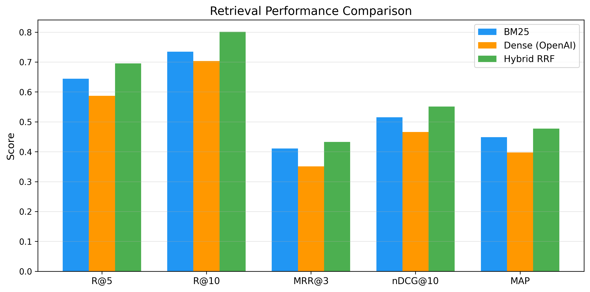
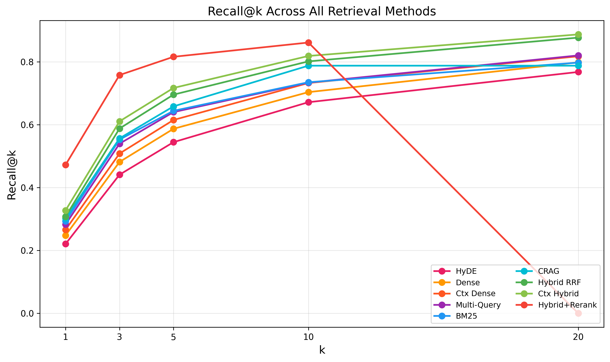
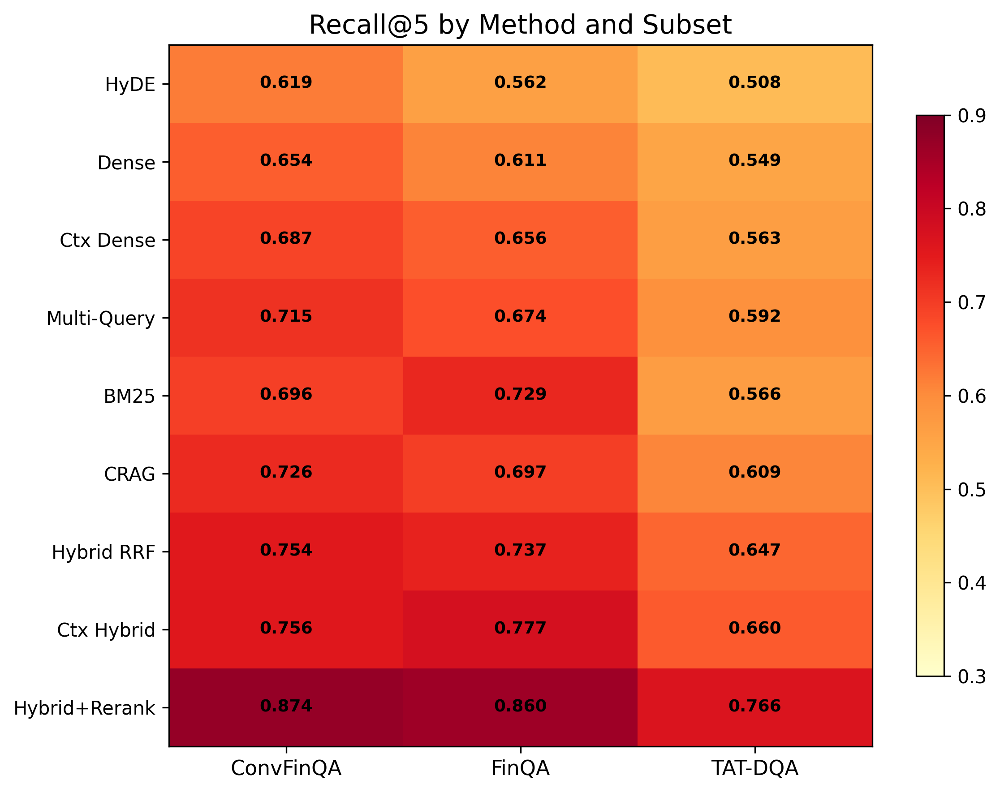
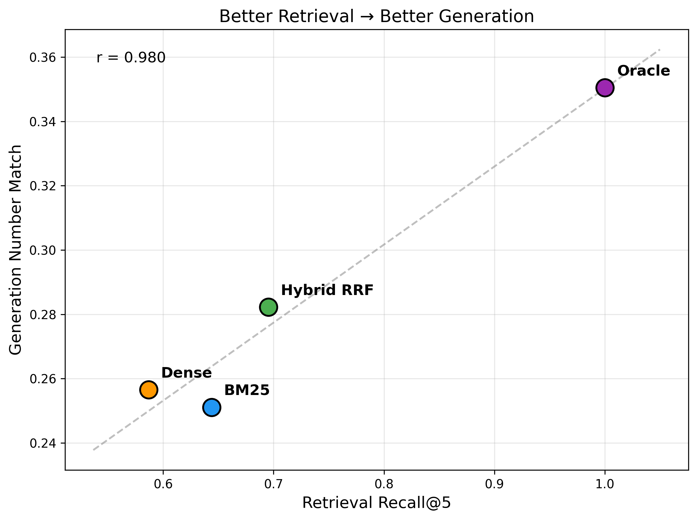
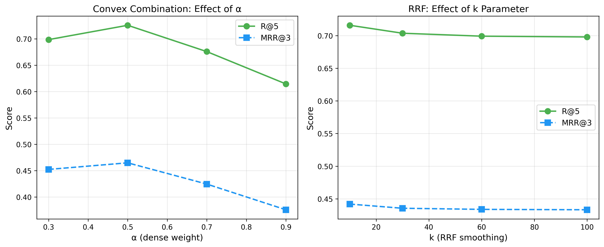
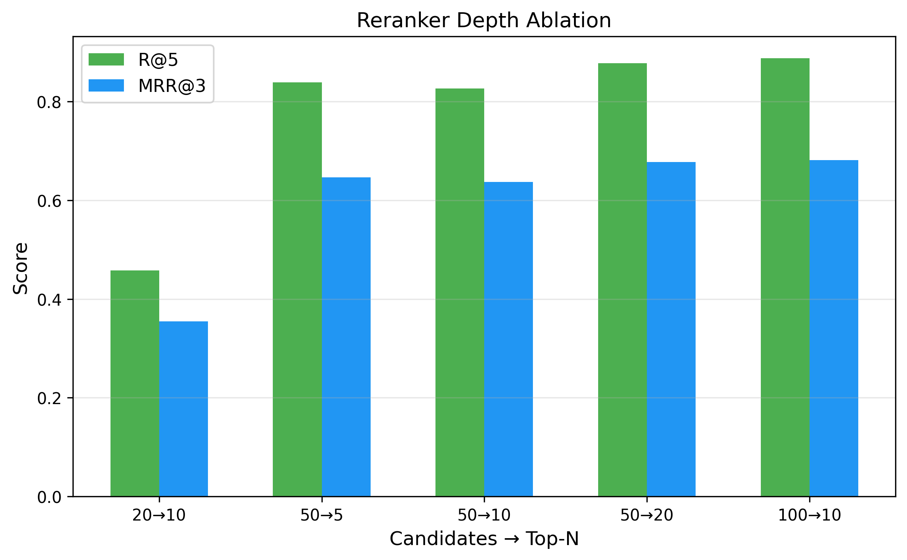

# From BM25 to Corrective RAG: Benchmarking Retrieval Strategies for Text-and-Table Documents

> Comprehensive benchmark of 10 RAG retrieval methods on [T²-RAGBench](https://huggingface.co/datasets/G4KMU/t2-ragbench) (23,088 financial QA pairs, 7,318 documents with text + tables).

**Authors:** Meftun Akarsu (THI) · Christopher Mierbach (Radiate)

**Paper:** [LaTeX source](paper/main.tex) · **Dataset:** [T²-RAGBench on HuggingFace](https://huggingface.co/datasets/G4KMU/t2-ragbench)

---

## Key Findings

| # | Method | Category | R@5 | MRR@3 | nDCG@10 |
|---|--------|----------|-----|-------|---------|
| 1 | HyDE | Query expansion | 0.544 | 0.318 | 0.433 |
| 2 | Dense (text-embed-3-large) | Single-method | 0.587 | 0.351 | 0.466 |
| 3 | Contextual Dense | Index augmentation | 0.615 | 0.373 | 0.490 |
| 4 | Multi-Query + RRF | Query expansion | 0.640 | 0.397 | 0.506 |
| 5 | BM25 | Sparse baseline | 0.644 | 0.411 | 0.515 |
| 6 | CRAG | Adaptive/Agentic | 0.658 | 0.415 | 0.536 |
| 7 | Hybrid RRF | Fusion | 0.695 | 0.433 | 0.551 |
| 8 | Contextual Hybrid | Index augment. + fusion | 0.717 | 0.454 | 0.571 |
| 9 | **Hybrid + Cohere Rerank** | **Fusion + rerank** | **0.816** | **0.605** | **0.683** |

### Main Results



### Recall@k Curves



### Per-Subset Heatmap



### Better Retrieval → Better Generation



### Fusion Method Ablation



### Reranker Depth Ablation



---

## Headline Results

1. **Reranking is the most impactful component** — Hybrid + Cohere Rerank v4.0 Pro achieves R@5=0.816, +17pp MRR@3 over unreranked hybrid
2. **BM25 beats dense retrieval** on this financial benchmark — lexical matching captures domain-specific terminology that embeddings dilute
3. **HyDE hurts performance** — hypothetical document generation introduces numerical hallucinations for financial QA
4. **CRAG provides moderate gains** — 63% of queries triggered self-correction, but cannot match hybrid fusion
5. **Contextual Retrieval consistently improves** — +2-3pp across all metrics via document-level context enrichment

## Error Analysis

- 73% of failures: **table structure mismatch** — embeddings struggle with tabular layouts
- 20%: **numerical reasoning** — questions require computation, not direct lookup
- TAT-DQA is the hardest subset (35.6% failure rate)

---

## Project Structure

```
├── paper/                # LaTeX source + figures
│   ├── main.tex          # Full paper
│   ├── references.bib    # 38+ citations
│   └── figures/          # Publication-ready PDF/PNG
├── src/
│   ├── data_loader.py    # T²-RAGBench loader
│   ├── chunking.py       # Chunking strategies
│   ├── retrieval/        # 8 retriever implementations
│   │   ├── base.py       # Embedders (Azure OpenAI, Cohere, Voyage, local)
│   │   ├── bm25_retriever.py
│   │   ├── dense_retriever.py
│   │   ├── hybrid_retriever.py
│   │   ├── hyde_retriever.py
│   │   ├── hype_retriever.py
│   │   ├── contextual_retriever.py
│   │   ├── multi_query_retriever.py
│   │   └── colbert_retriever.py
│   ├── reranking/        # Cohere, CrossEncoder, FlashRank
│   ├── generation/       # LLM generation pipeline
│   └── evaluation/       # Retrieval + generation metrics + statistical tests
├── configs/default.yaml  # All hyperparameters
├── scripts/
│   ├── run_experiment.py
│   ├── run_all_experiments.py
│   ├── analyze_results.py
│   └── sanity_check.py
└── data/
    ├── raw/              # T²-RAGBench (auto-downloaded)
    ├── processed/        # FAISS indices, embeddings
    └── results/          # Experiment JSONs
```

## Setup

```bash
# Clone
git clone https://github.com/mftnakrsu/rag-research-paper.git
cd rag-research-paper

# Environment
python3.11 -m venv .venv
source .venv/bin/activate
pip install -e ".[dev]"

# Configure API keys
cp .env.example .env
# Edit .env with your Azure/OpenAI keys

# Sanity check (downloads data + runs BM25 on 100 queries)
python scripts/sanity_check.py

# Run a single experiment
python scripts/run_experiment.py --method bm25 --top-k 20

# Run all tier-1 experiments
python scripts/run_all_experiments.py --tier 1
```

## Models Used

| Model | Provider | Purpose |
|-------|----------|---------|
| text-embedding-3-large | Azure OpenAI | Document & query embedding |
| GPT-4.1-mini | Azure OpenAI | HyDE, Multi-Query, CRAG, Contextual Retrieval |
| GPT-5.4 | Azure OpenAI | Generation comparison, error analysis |
| Cohere Rerank v4.0 Pro | Azure AI | Cross-encoder reranking |

## Citation

```bibtex
@article{akarsu2026retrieval,
  title={From BM25 to Corrective RAG: Benchmarking Retrieval Strategies for Text-and-Table Documents},
  author={Akarsu, Meftun and Mierbach, Christopher},
  year={2026}
}
```

## Acknowledgments

We thank Christopher Mierbach and [Radiate](https://radiaite.com) for providing Azure AI compute credits.

This work builds on [T²-RAGBench](https://arxiv.org/abs/2506.12071) by Strich et al. (EACL 2026).
